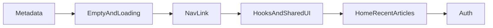

# Frontend Roadmap — Pre-Auth Enhancements

A step-by-step guide for improving the **my-blog** React frontend before adding user authentication. Use the checkboxes to track progress as you work through each item.

**Project root:** `/home/adri/Music/MERN-course`  
**Frontend app:** `my-blog/`  
**Backend API:** `my-blog-backend/` (runs on `http://localhost:8000`)

---

## Tutor Principle

> **Before auth, focus on structure and display. After auth, focus on permissions and ownership.**

Do not build edit/delete or "my articles" yet — without login, there is no way to know who owns what. Do build metadata, shared hooks, cleaner components, and protected-route *structure* so auth slots in cleanly.

---

## 1. Current State Snapshot

### What you already have

| Feature | Status |
|---------|--------|
| List all articles | Done |
| View single article | Done |
| Upvote article | Done |
| Add comments | Done |
| Write new article | Done |
| User authentication | Not started |
| Edit / delete articles | Not started |

### Routes (`my-blog/src/App.js`)

| URL | Page | Purpose |
|-----|------|---------|
| `/` | `HomePage` | Landing / intro |
| `/about` | `AboutPage` | Static about page |
| `/articles-list` | `ArticleListPage` | Fetches and lists all articles |
| `/article/:slug` | `ArticlePage` | Single article + sidebar + comments |
| `/write` | `WriteArticlePage` | Create new article form |
| `*` | `NotFoundPage` | 404 page |

### Folder map (`my-blog/src/`)

```
src/
├── index.js              # React entry point — mounts app into #root
├── App.js                # Shell layout + routing
├── NavBar.js             # Top navigation
├── pages/                # One file = one full screen (tied to a URL)
│   ├── HomePage.js
│   ├── AboutPage.js
│   ├── ArticleListPage.js
│   ├── ArticlePage.js
│   ├── WriteArticlePage.js
│   └── NotFoundPage.js
├── components/           # Reusable UI pieces (receive data via props)
│   └── ArticlesList.js
└── services/
    └── api.js            # All backend fetch calls (no UI here)
```

### API functions (`my-blog/src/services/api.js`)

| Function | Method | Endpoint |
|----------|--------|----------|
| `getArticles()` | GET | `/api/articles` |
| `getArticle(slug)` | GET | `/api/articles/:slug` |
| `upvoteArticle(slug)` | POST | `/api/articles/:slug/upvote` |
| `addComment(slug, { author, text })` | POST | `/api/articles/:slug/comments` |
| `createArticle({ title, body, author })` | POST | `/api/articles` |

### Article data shape (from backend)

```javascript
{
  id: "my-new-post",
  slug: "my-new-post",
  title: "My New Post",
  author: "Jane Doe",
  createdAt: "2026-06-11T12:00:00.000Z",
  content: ["Paragraph 1", "Paragraph 2"],  // array of strings
  upvotes: 0,
  comments: [{ id, author, text, createdAt }]
}
```

**Note:** When creating an article you send `body` (one string). The backend returns `content` (array of paragraphs). Blank lines (`\n\n`) in the body become separate paragraphs.

### Patterns already in use

- **Local state only** — `useState` + `useEffect` in pages; no Redux or Context
- **Props flow down** — pages fetch data, pass to `ArticlesList`
- **Controlled inputs** — `value` + `onChange` on form fields
- **API layer** — all `fetch` calls centralized in `services/api.js`

### What is still early-stage

- Very little reuse between pages (same fetch/form patterns copied)
- Minimal tests (one smoke test in `App.test.js`)
- Basic loading/error UI (`<p>Loading…</p>`)
- No article metadata displayed (author, date) on list or detail views
- Anyone can write — no auth gate yet
- Duplicate form CSS between `WriteArticlePage.css` and `ArticlePage.css`

---

## 2. Enhance Before Auth (Priority Items)

Work through these before starting user authentication.

### 2.1 Show article metadata (high value, easy)

- [ ] Display **author** and **createdAt** under the title on `ArticlePage`
- [ ] Show author and date as a subtitle in `ArticlesList` links
- [ ] Add styles in `ArticlePage.css` and `ArticlesList.css`

**Files to touch:**
- `my-blog/src/pages/ArticlePage.js`
- `my-blog/src/pages/ArticlePage.css`
- `my-blog/src/components/ArticlesList.js`
- `my-blog/src/components/ArticlesList.css`

**Why before auth:** Once users log in, author comes from their account — the UI slot is already there.

**Tip:** Use `new Date(article.createdAt).toLocaleDateString()` or a shared `formatDate()` helper.

---

### 2.2 Extract repeated fetch/form patterns

The same pattern appears in `ArticleListPage`, `ArticlePage`, and `WriteArticlePage`:

```
useState → useEffect or handler → api call → loading / error / success
```

- [ ] Create `my-blog/src/hooks/useArticles.js` — fetch all articles, return `{ articles, loading, error, refetch }`
- [ ] Create `my-blog/src/components/LoadingMessage.js` — shared loading UI
- [ ] Create `my-blog/src/components/ErrorMessage.js` — shared error UI
- [ ] Refactor `ArticleListPage` and `ArticlePage` to use `useArticles`

**Why before auth:** Auth adds login state, protected routes, and token headers — cleaner structure makes that much easier.

---

### 2.3 Address double-fetch on ArticlePage

`ArticlePage` currently calls both `getArticles()` and `getArticle(slug)` on every visit:

```javascript
Promise.all([api.getArticles(), api.getArticle(slug)])
```

- [ ] **Option A (simple):** Keep as-is — sidebar needs the full list anyway; document the tradeoff
- [ ] **Option B (better):** Use `useArticles()` hook cached at layout level so the list is fetched once, not on every article click
- [ ] **Option C (later):** Backend endpoint like `GET /api/articles/:slug` with optional sidebar data — only if you outgrow the simple approach

**Files to touch:**
- `my-blog/src/pages/ArticlePage.js`
- `my-blog/src/hooks/useArticles.js` (if Option B)

---

### 2.4 Empty and edge states

- [ ] `ArticleListPage` — show "No articles yet" with a link to `/write` when list is empty
- [ ] `ArticlesList` — handle `articles.length === 0` gracefully
- [ ] `WriteArticlePage` — optional success message before redirect
- [ ] Add `ErrorBoundary` component so one crash does not white-screen the app

**Files to touch:**
- `my-blog/src/pages/ArticleListPage.js`
- `my-blog/src/components/ArticlesList.js`
- `my-blog/src/components/ErrorBoundary.js` (new)

---

### 2.5 NavBar improvements

- [ ] Replace `Link` with `NavLink` from `react-router-dom` for active link highlighting
- [ ] Add active class styles in `NavBar.css`
- [ ] Fix indentation inconsistency in `NavBar.js` (4 spaces vs 2 elsewhere)
- [ ] Plan a placeholder slot for "Login / Register" (even before auth is built)

**Files to touch:**
- `my-blog/src/NavBar.js`
- `my-blog/src/NavBar.css`

**Tip:** `NavLink` automatically adds an `active` class when the URL matches.

---

### 2.6 Plan to remove manual author fields (do not delete yet)

These are **temporary** until auth is added:

- `WriteArticlePage` — "Author (optional)" input
- `ArticlePage` — "Your name (optional)" on comment form

- [ ] Tag these fields mentally as temporary
- [ ] When auth is added: remove author inputs; use logged-in user's name from session/token

**Files affected later:**
- `my-blog/src/pages/WriteArticlePage.js`
- `my-blog/src/pages/ArticlePage.js`

---

### 2.7 Environment config

- [ ] Create `my-blog/.env.example` with:

```
REACT_APP_API_URL=http://localhost:8000
```

- [ ] Document in `my-blog/README.md` that devs should copy to `.env` for custom API URL

`api.js` already reads `process.env.REACT_APP_API_URL` — this just documents it.

---

### 2.8 Basic tests

Currently only one smoke test exists (`App.test.js` checks site title).

- [ ] `ArticlesList` — renders article titles from mock data
- [ ] `WriteArticlePage` — submit button disabled when title is empty
- [ ] `api.js` — mock `fetch` and verify error handling on non-OK response

**Files to touch:**
- `my-blog/src/App.test.js`
- `my-blog/src/components/ArticlesList.test.js` (new)
- `my-blog/src/pages/WriteArticlePage.test.js` (new)
- `my-blog/src/services/api.test.js` (new)

**Tip:** No need for 100% coverage — protect the parts you change most often.

---

## 3. Mature App Features (Grouped by Timing)

### Good before auth (frontend-only or small changes)

| Feature | Effort | Notes |
|---------|--------|-------|
| Article metadata (author, date) | Low | See section 2.1 |
| Sort articles (newest, most upvoted) | Low | Client-side sort on existing `getArticles()` data |
| Search / filter by title | Low–Medium | Client-side filter on article list |
| Home page "recent articles" preview | Low | Fetch articles on `HomePage`, show 3–5 latest |
| Relative dates ("2 days ago") | Low | Small `formatRelativeDate()` helper |
| Responsive pass on mobile | Low | Article layout grid may feel tight below 640px |
| Loading / 404 polish | Low | Shared components, skeleton or spinner |

Checklist:

- [ ] Sort articles (newest first, most upvoted)
- [ ] Search/filter on article list page
- [ ] Recent articles preview on HomePage
- [ ] Relative date formatting
- [ ] Mobile responsive review
- [ ] Improved loading states (spinner or skeleton)

---

### Better with auth (wait until login exists)

| Feature | Why wait |
|---------|----------|
| Protected `/write` route | Needs login check |
| "My articles" dashboard | Needs user ID |
| Edit / delete own articles | Needs ownership checks on backend |
| User profile page | Needs user model |
| Comment as logged-in user | Remove guest name field |
| Upvote once per user | Needs user tracking on backend |

Checklist (for later):

- [ ] Protected routes wrapper component
- [ ] My articles page
- [ ] Edit article page
- [ ] Delete article (with confirmation)
- [ ] User profile page
- [ ] Per-user upvote limit

---

### Nice later (bigger scope)

- [ ] Markdown editor for article body
- [ ] Draft / publish workflow
- [ ] Pagination or infinite scroll
- [ ] Tags / categories
- [ ] Dark / light theme toggle
- [ ] Migrate Create React App → Vite
- [ ] TypeScript for type safety across frontend + API

---

## 4. Cleanup Checklist

Code hygiene items that reduce duplication and prepare for auth.

- [ ] **Merge duplicate form CSS** — `WriteArticlePage.css` and `ArticlePage.css` (comment form) share nearly identical input/textarea/button styles; extract to `styles/forms.css` or a `FormField` component
- [ ] **Split `ArticlePage.js`** — extract comments section (~50 lines) into `components/CommentSection.js`
- [ ] **Fix `NavBar.js` indentation** — align with 2-space style used elsewhere
- [ ] **Audit unused styles in `App.css`** — `h3` and `ul` rules may not be used on current pages
- [ ] **Centralize date formatting** — create `utils/formatDate.js` instead of inline `toLocaleDateString()` calls

### Target folder structure (after cleanup)

```
my-blog/src/
├── pages/
│   ├── ArticlePage.js       ← shorter; delegates to CommentSection
│   ├── WriteArticlePage.js
│   └── ArticleListPage.js   ← uses useArticles hook
├── components/
│   ├── ArticlesList.js
│   ├── CommentSection.js    ← new
│   ├── LoadingMessage.js    ← new
│   ├── ErrorMessage.js      ← new
│   └── ErrorBoundary.js     ← new
├── hooks/
│   └── useArticles.js       ← new
├── utils/
│   └── formatDate.js        ← new
├── services/
│   └── api.js               ← later: add auth token header
└── context/                 ← later: AuthContext when auth is added
```

---

## 5. Recommended Implementation Order

Follow this sequence — each step builds on the previous one.



| Step | Task | Effort | Impact |
|------|------|--------|--------|
| 1 | Show author + date on article page and list | Low | High |
| 2 | Empty states + better loading UI | Low | Medium |
| 3 | Active nav links with `NavLink` | Low | Medium |
| 4 | Extract `useArticles` hook + shared Loading/Error components | Medium | High |
| 5 | Home page recent articles + search/sort | Low–Medium | Medium |
| 6 | User authentication | Large | Foundation for multi-user |

Progress tracker:

- [ ] Step 1 — Metadata
- [ ] Step 2 — Empty and loading states
- [ ] Step 3 — NavLink active state
- [ ] Step 4 — Hooks and shared UI
- [ ] Step 5 — Home recent articles / search / sort
- [ ] Step 6 — Auth

---

## 6. Git Tips (MERN-course monorepo)

Your git repo root is **`MERN-course/`**, not `my-blog-backend/` or `my-blog/`.

| Command location | What `git add .` stages |
|------------------|-------------------------|
| Inside `my-blog-backend/` | Only backend files |
| Inside `my-blog/` | Only frontend files |
| Inside `MERN-course/` | Everything in the project |

**Always run `git status` from the repo root before committing.** If you see "Changes not staged" or "Untracked files" after `git add`, those files were not included.

To commit frontend changes from repo root:

```bash
cd /home/adri/Music/MERN-course
git add my-blog/
git status
git commit -m "your message here"
git push
```

---

## 7. Quick Reference — Key Files

| File | Purpose |
|------|---------|
| `my-blog/src/index.js` | Mount React app |
| `my-blog/src/App.js` | Shell layout + all routes |
| `my-blog/src/NavBar.js` | Top nav (Home, About, Articles, Write) |
| `my-blog/src/services/api.js` | Backend HTTP client |
| `my-blog/src/pages/ArticleListPage.js` | List all articles (read) |
| `my-blog/src/pages/ArticlePage.js` | View one article; upvote and comment |
| `my-blog/src/pages/WriteArticlePage.js` | Create new article form |
| `my-blog/src/components/ArticlesList.js` | Clickable article sidebar/list |

---

*Last updated: June 2026 — after write-article feature was implemented on the frontend.*
