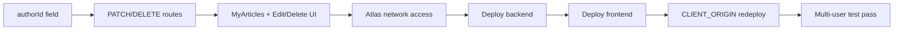

# `Wrap-Up Roadmap — Ownership Features + Going Live

The final phase before this project is "done": finish the two features that need real
ownership logic, then host it publicly so you can watch actual multiple users hit it —
which is the whole point of building auth in the first place.

**Project root:** `/home/adri/Music/MERN-course`
**Frontend app:** `my-blog/` **Backend API:** `my-blog-backend/`
**Prior roadmaps (both fully complete):** [FRONTEND_ROADMAP.md](FRONTEND_ROADMAP.md), [BACKEND_AUTH_ROADMAP.md](BACKEND_AUTH_ROADMAP.md)

---

## Tutor Principle

> **Auth isn't finished until something is actually *owned*.**

Login/logout proves *who* someone is. It's only worth having once at least one action is
restricted to "the person who created this, and nobody else." That's what Part A builds.
Everything else on the old roadmaps' "nice later" list (markdown editor, tags, dark mode,
TypeScript/Vite migration) is genuinely skippable — you won't lose a core MERN concept by
cutting it.

---

## 1. Where you are right now

| Milestone | Status |
|---|---|
| CRUD blog (list/view/write/comment) | Done |
| JWT auth (register/login/logout, protected `/write`) | Done |
| Per-user upvote toggle (was: unlimited spam-clicking) | **Done today** — see `my-blog-backend/src/store/articleStore.js` (`toggleUpvote`), `middleware/optionalAuthenticate.js` |
| Ownership (edit/delete your own articles) | Not started — **this section** |
| Hosted publicly, multi-user reachable | Not started — **this section** |

---

## 2. ⚠️ A gotcha you'll hit before you can do ownership checks

Right now `Article.author` is just a **display-name string** copied from `req.user.username`
at creation time (`my-blog-backend/src/store/articleStore.js`, `create()`). The `User` model
enforces `unique: true` on `email` — but **not** on `username**:

```js
// my-blog-backend/src/models/User.js
username: { type: String, required: true, trim: true, maxlength: 50 },  // no unique: true
```

If two people both register as `"alex"`, comparing `article.author === req.user.username` to
decide "can this person edit/delete this article" would let the *second* Alex edit the
*first* Alex's posts. A display name is not a safe identity key.

**Fix before building ownership checks:** add a real foreign key.

```js
// Article.js — add alongside the existing `author` display string
authorId: { type: String, required: true },   // req.user.userId at creation time
```

Ownership checks then compare `article.authorId === req.user.userId` (both are Mongo
ObjectIds-as-strings — collision-proof by construction), while `author` stays purely
cosmetic for display. This is the same lesson as `passwordHash` vs `password` from the auth
roadmap: name/shape your fields so the *unsafe* comparison isn't even available.

> **Tip:** Existing articles won't have `authorId` (same "old data lacks the new field"
> situation as the upvote migration). Since this is a learning DB, easiest fix is deciding
> those old articles are simply un-editable/un-deletable by anyone (no `authorId` = no
> match), rather than writing a backfill migration.

---

## 3. Part A — Ownership features

### 3.1 Backend: protect write access to a specific article — ✅ Done 2026-08-11

- [x] Add `authorId` to `Article` schema (see gotcha above)
- [x] Set `authorId: req.user.userId` in `articleStore.create()`
- [x] New `PATCH /api/articles/:slug` — `authenticate` required; 403 if not the owner; updates `title`/`content`
- [x] New `DELETE /api/articles/:slug` — same ownership check; removes the document
- [x] Both return 404 if the slug doesn't exist, 403 if it exists but isn't yours

**Implementation note:** raw `authorId` is never sent to the client — same pattern as
`hasUpvoted` from the upvote fix. `toApiArticle()` computes an `isOwner: boolean` per
response by comparing `doc.authorId` to the requesting user's ID server-side
(`my-blog-backend/src/store/articleStore.js`). The frontend checks `article.isOwner`,
never a raw ID comparison.

**Verified live:** registered two temp users, confirmed non-owner gets 403 on both
PATCH and DELETE, unauthenticated gets 401, owner's PATCH/DELETE succeed (200/204) —
then cleaned up all test data.

**Files touched:** `models/Article.js`, `store/articleStore.js`, `routes/articles.js`

### 3.2 Frontend: "My Articles" + edit/delete UI — ✅ Done 2026-08-12

- [x] `my-blog/src/pages/MyArticlesPage.js` (new) — reuses `useArticles()`, filters client-side where `article.isOwner`; refetches on mount so `isOwner` is fresh even if the list was cached from before login
- [x] Route `/my-articles`, wrapped in `<ProtectedRoute>`, linked from NavBar (only rendered when logged in)
- [x] `EditArticlePage.js` (new) — same form shape as `WriteArticlePage`, pre-filled from `getArticle()`, `PATCH` instead of `POST`; bounces non-owners with an error message as a second layer behind the server check
- [x] Delete button on **both** `ArticlePage` (inline, owner-only) and `MyArticlesPage` (list actions) — `window.confirm()` before calling `DELETE`, cached list updated via new `removeArticle()` in `useArticles()`

**Verified:** production build compiles clean; live API test (register → create → confirm `isOwner: true` in both the create response and the list endpoint → edit → delete → confirm 404) — then cleaned up test data.

**Files touched:** `pages/MyArticlesPage.js` + `.css` (new), `pages/EditArticlePage.js` (new), `App.js` (routes), `NavBar.js` (dynamic nav items), `pages/ArticlePage.js` + `.css` (owner-only edit/delete), `hooks/useArticles.js` (`removeArticle`), `services/api.js` (`updateArticle`, `deleteArticle`, 204-response handling)

> **Note:** Hide the edit/delete buttons in the UI *and* enforce it server-side. The UI
> check is for a good experience; the server check is what actually stops a malicious
> request sent directly with curl/Postman past your frontend entirely.

### 3.3 Optional, same session: comment as logged-in user — ✅ Done 2026-08-15

- [x] Dropped the "Your name (optional)" input in `ArticlePage.js`'s comment form; guests now see a small "Posting as Guest — log in..." note instead
- [x] Backend derives comment author from `req.user?.username` (never trusts client-supplied name), falling back to `'Guest'` for anonymous requests — same pattern as `authorId` on articles

**Verified live:** posted a comment as guest (no token) → `author: "Guest"`; posted as a logged-in test user → `author: "WrapupTester"`; cleaned up the test article and test user afterward. Also removed the now-unused `.article-comments__input` CSS rule.

**Files touched:** `my-blog-backend/src/routes/articles.js`, `my-blog/src/services/api.js`, `my-blog/src/pages/ArticlePage.js`, `my-blog/src/pages/ArticlePage.css`

---

## 4. Part B — Host it so real multiple users can hit it

This is the actual goal: watching concurrent, independent users register, write, upvote,
and comment is what makes "multi-user" click as a concept, in a way that solo `curl`
testing on localhost never will.

### 4.1 What you already have for free

Your `.env` already points at **MongoDB Atlas** (`mongodb+srv://...cluster0.mongodb.net`),
not a local Mongo — so the database is *already* cloud-hosted and reachable from anywhere.
You only need to deploy the **backend** (Express API) and the **frontend** (React build).

- [ ] Atlas dashboard → Network Access → confirm `0.0.0.0/0` (allow-from-anywhere) is enabled, since your hosting provider's outbound IP isn't fixed on free tiers

### 4.2 Deploy the backend

Pick one host (Render's free tier is the most beginner-friendly: connects straight to your
GitHub repo, auto-redeploys on push).

- [ ] Push this repo to GitHub if it isn't already (`git remote -v` to check)
- [ ] New Web Service on Render → root directory `my-blog-backend/` → build `npm install` → start `npm start`
- [ ] Set environment variables in Render's dashboard (**not** in git):
  - `MONGODB_URI` — same Atlas string you already have
  - `JWT_SECRET` — **generate a fresh one for production**, don't reuse your local dev secret
  - `JWT_EXPIRES_IN=7d`
  - `CLIENT_ORIGIN` — you'll fill this in *after* step 4.3, once you know the frontend's live URL
  - `PORT` — Render sets this itself; your `server.js` already reads `process.env.PORT`
- [ ] Confirm `GET https://<your-backend>.onrender.com/api/health` returns `{"status":"ok", "db":"connected"}`

> **Tip:** Free-tier Render spins the server down after ~15 minutes idle and takes ~30–50s
> to wake back up on the next request. Don't mistake that cold-start delay for a bug when
> you share the link with friends.

### 4.3 Deploy the frontend

- [ ] New Static Site on Vercel or Netlify → root directory `my-blog/` → build `npm run build` → publish `build/`
- [ ] Set env var `REACT_APP_API_URL=https://<your-backend>.onrender.com` (React reads this at *build* time — changing it later requires a redeploy, not just a restart)
- [ ] Redeploy backend once more with `CLIENT_ORIGIN` set to this frontend's live URL — CORS (`my-blog-backend/src/app.js:15`) only allows a single configured origin, so this step isn't optional, requests will be blocked without it

### 4.4 Actually go watch multi-user behavior

- [ ] Register 2–3 accounts from different browsers/incognito windows (or hand the link to a friend)
- [ ] Have each account write an article, upvote each other's posts, toggle votes on and off, comment
- [ ] Open the Atlas dashboard → Collections and watch `users` / `articles` fill up in real time — this is the payoff: seeing independent documents with distinct `authorId`s and `upvoterIds` arrays growing from genuinely different people, not one person clicking twice

---

## 5. Recommended order



Do Part A first — deploying broken ownership logic to strangers is a worse first
impression than deploying late. Comment-as-logged-in-user (3.3) can slot in anywhere
since it's independent.

---

## 6. Explicitly out of scope for wrap-up

Everything already marked "nice later" in `FRONTEND_ROADMAP.md` section 3 stays deferred:
markdown editor, draft/publish workflow, pagination, tags, dark mode, Vite/TypeScript
migration. None of these teach a new MERN concept you haven't already used — they're
production polish for a project you're intentionally not taking further right now.

---

## Progress Tracker

- [x] 3.1 — `authorId` field + ownership-safe backend routes
- [x] 3.2 — My Articles page + Edit/Delete UI
- [x] 3.3 — Comment as logged-in user (optional, low effort)
- [ ] 4.2 — Backend deployed
- [ ] 4.3 — Frontend deployed + CORS wired
- [ ] 4.4 — Verified with real multi-user test pass

---

*Created: 2026-08-11 — after fixing the upvote-toggle bug, scoped as the final phase before moving to a new pet project.*`
